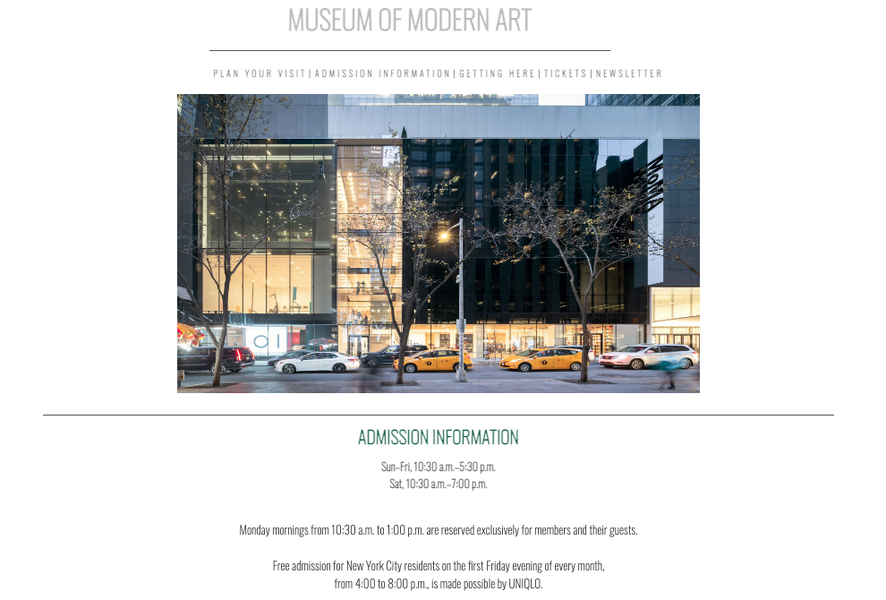
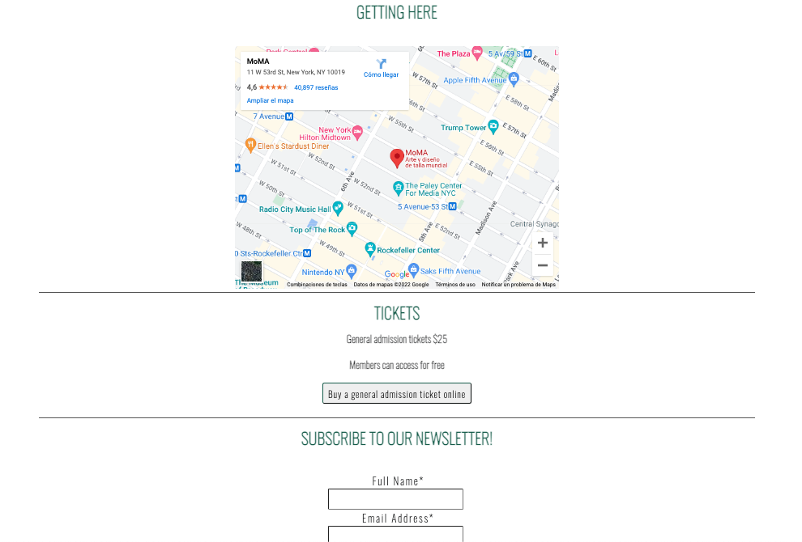
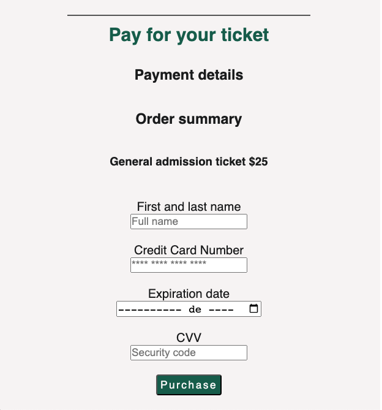
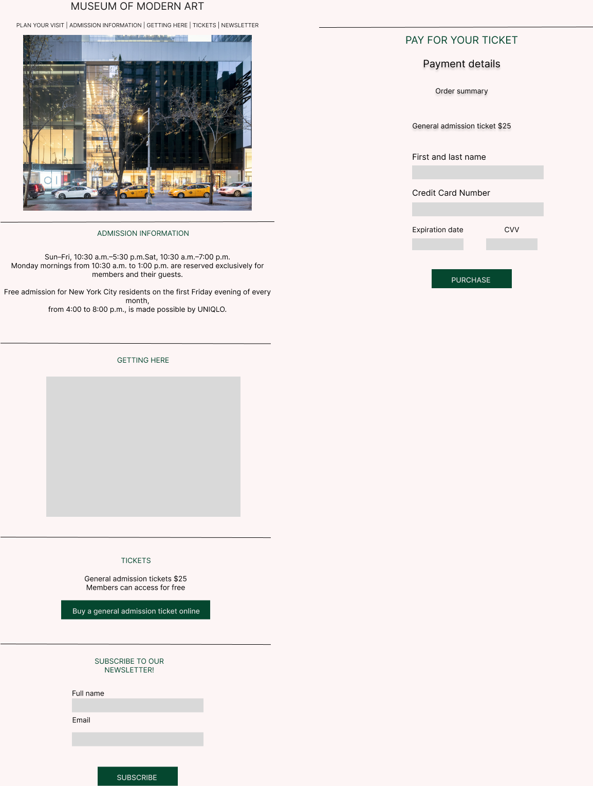

# WELCOME TO THE MUSEUM OF MODERN ART! 

## i. Resumen
 El proyecto **"Welcome to the museum of modern art!"**, surge como respuesta a facilitar un proceso de pago que se realiza frecuentemente a través de la web. Esta transacción ocurre de una forma segura, eficiente y rápida, y permite a las usuarias ahorrar tiempo, pues el tiempo aproximado de compra a través de esta página web es de 45 segundos a 1 minuto, mientras que de forma presencial, este proceso tomaría desde 5 hasta 20 minutos, dependiendo del horario y día de compra.

## ii. Imagen final del proyecto

## iii. Investigación UX

Las y los usuarios de mi producto son estudiantes, docentes y personas en general con acceso a internet, a un dispositivo móvil y con una tarjeta bancaria, las cuales estén interesadas en asistir a exposiciones museísticas y que busquen hacer más eficiente y *contactless* el proceso de compra de un boleto de entrada al museo. 

Esta página web interactiva, propone una forma sencilla, eficiente y rápida de adquirir un boleto para asistir al museo de arte moderno. A través de este proceso, la usuaria puede adquirir su entrada sin hacer filas y sin tener un contacto directo con otra persona, lo cual ahorra su tiempo de una forma significativa, tomando en cuenta que el tiempo de espera estimado para comprar un boleto de forma física es de entre 5 y 20 minutos. 

## v. Prototipo inicial en papel

 
## vi. Feedback recibido

Al compartir mi prototipo con una de mis compañeras, me hizo algunas observaciones. Ella me sugirió que las secciones fueran en un orden que respondiera a lo que la usuaria busca, además de agregar un header para que el acceso a las distintas secciones fuera más sencillo. 

## vii. Imagen del prototipo final

